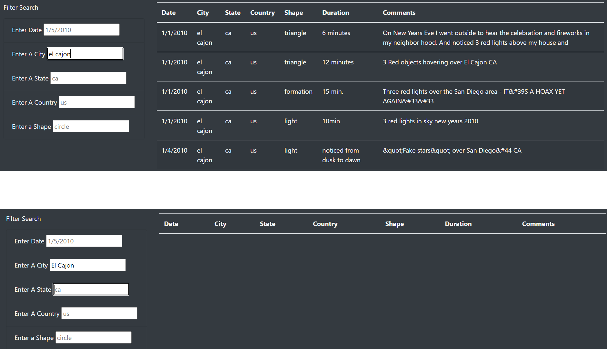
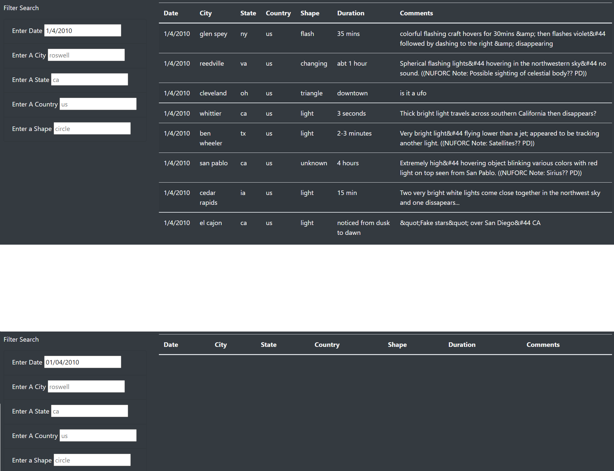

# UFOs
## Overview of Project: 
<!-- Explain the purpose of this analysis. -->
An aspiring UFO-ologist is designing a website to display data surrounding past UFO sightings. This repo provides code to create a functioning HTML webpage using Javascript elements to create and filter a table from a previously compiled data object. 

### Resources Used
* Data Source: static/js/data.js
* Bootstrap: 4.0.0
* D3: 4.11.0

## Results: 
<!-- Describe to Dana how someone might use the new webpage by walking her through the process of using the search criteria. Use images of your webpage during the filtering process to support your explanation. -->

This webpage is quite user-friendly to operate, but may require some additional instructions. To operate the search function on the table, all a user needs to do is input a specific value into the corresponding input box for one of the following columns in the table: Date, City, State, Country, Shape. The input *needs to be an exact match* to the text as written in the table. As such, it may be prudent to add a disclaimer near the search function to alleviate some user frustration on why capitalized searches, or dates with "0's" result in a blank table. See Fig1 and Fig2 for visual examples of these potential frustration points.

**FIG 1**

A user enters the location El Cajon, CA using lower-case letters vs. upper-case letters.

**FIG 2**

A user searches for January 4th, 2010 with '1/4/2010' and '01/04/2010'.

### Behind The Scenes
Behind the scenes the program performs the following steps:
1. First, a function will check if any of the input boxes have been changed, by having d3 selectAll html items with the tag "input", and apply the "updateFilters" function if that html item has been changed.
2. Gathers any edited filters and stores the user-input value and the desired column attribute. Those are both then stored in a dictionary called "filters".
3. Now a separate function will loop through the table data and place restrictions based on the entries in the filters dictionary
    * The code has to use 'Object.entries(filters)' so it knows to look at the entire dictionary entry in "filters"
    * It also has to use 'forEach(([key,val])' so that it knows to check the key in the dictionary (attribute/column to be filtered) and the value in the dictionary (the user-input that should hopefully be located in select entries for that particular column)

## Summary: 
<!-- In a summary statement, describe one drawback of this new design and two recommendations for further development. -->
One major drawback of this particular web design is that the user needs to input an exact match in regards to their search criteria. This is especially frustrating as some of the data entries in the table are not using the standard version of their data type (i.e. state abbreviations typically use two capital letters, but the table uses two lowercase letters). Some recommendations on circumventing this issue are:
1. If not planning to change any of the code functionality, there should at minimum be a warning displayed near the search boxes letting users know they need to type in the *exact* value they want to see in the table.
2. It may be worth changing the object values in the data.js file to reflect standard naming practices. This would be a very time-consuming process to change the current values, but may cut down on user frustration.
3. If keeping the non-standard values in the table, there is also an option to adjust the user input to match the format in the table. Examples of this may include:
    * Apply the .toLowerCase() function on user inputs for strings.
    * Apply regex transformations on date values.